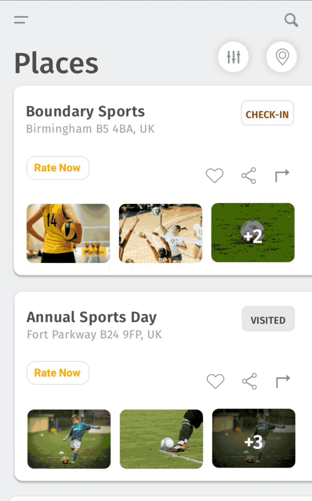

<h1>Introduction</h1>
INTUZ brings to you an amazing readymade component which allows you to integrate Rating features inside your React Native based application supporting both Android and iOS platforms. Try it your self by following below instructions, Happy Coding.

<br>
<h1>Features</h1>

- Support to rate with Stars and comment
- Customizable header and input texts
- Customizable background color

<br>


<h1>Getting Started</h1>

> Import RateController in your .js file

```
import RateController from './app/component/RateController';     
```

> Render your RateController inside Modal

```
var rateModel = <Modal style={{
            marginLeft: 0,
            marginRight: 0,
            marginBottom: 0
        }} 
transparent={true} visible={this.state.rateModalVisible} onRequestClose={() => {
            this.setState({rateModalVisible: false}); }}>
            
<RateController callbackAfterRate={(rating, comment, otherValue) => {this.setState({rateModalVisible: false});
            console.log("Callback after rate popup dismissed");}} otherParamsToSend={this.state.otherParamsToSend}/>
        
</Modal>

```
<br>
<h1>Properties</h1>

| Available properties | Type | Default Value | Required | Description |
|--------------------------|------------------------|-------------------------------|----------|-------------------------------------------------------------------------------------------------------------------------------------------------------------------------|
| backgroundColor | String | white | No | Background color for popup |
| titleText | String | Your Ratings | No | Title of Rate controller |
| submitText | String | Submit | No | If true then component is not clickable. |
| placeHolderText | String | Enter your comment here | No | Placeholder text for comment |
| otherParamsToSend | - | - | No | Other parameters to send to Rate controller and want it back in callback from rate controller. For example you can pass order id to rate controller to rate particular rate |
| callbackAfterRate | Function  | - | Yes | Callback function will return selected stars, comment added by user and the other parameters which are sent to controller |

<br>
<h1>Bugs and Feedback</h1>

For bugs, questions and discussions please use the Github Issues.

<br>
<h1>License</h1>

Copyright (c) 2018 Intuz Solutions Pvt Ltd.
<br><br>
Permission is hereby granted, free of charge, to any person obtaining a copy of this software and associated documentation files (the "Software"), to deal in the Software without restriction, including without limitation the rights to use, copy, modify, merge, publish, distribute, sublicense, and/or sell copies of the Software, and to permit persons to whom the Software is furnished to do so, subject to the following conditions:
<br><br>
THE SOFTWARE IS PROVIDED "AS IS", WITHOUT WARRANTY OF ANY KIND, EXPRESS OR IMPLIED, INCLUDING BUT NOT LIMITED TO THE WARRANTIES OF MERCHANTABILITY, FITNESS FOR A PARTICULAR PURPOSE AND NONINFRINGEMENT. IN NO EVENT SHALL THE AUTHORS OR COPYRIGHT HOLDERS BE LIABLE FOR ANY CLAIM, DAMAGES OR OTHER LIABILITY, WHETHER IN AN ACTION OF CONTRACT, TORT OR OTHERWISE, ARISING FROM, OUT OF OR IN CONNECTION WITH THE SOFTWARE OR THE USE OR OTHER DEALINGS IN THE SOFTWARE.

<h1></h1>
<a href="http://www.intuz.com">

</a>